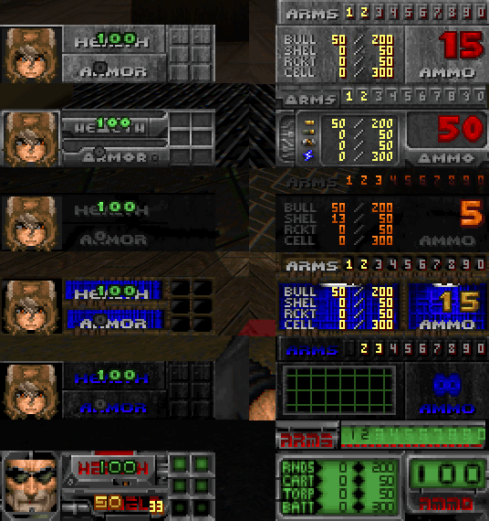
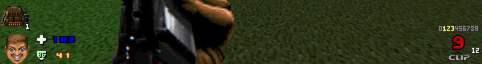
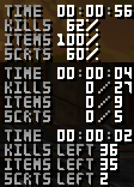
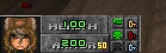

|[🇷🇺 Русский](README-RU.md) | [🇬🇧 English](README.md)|
|-|-|

[![CC BY-NC-SA 4.0][cc-by-nc-sa-shield]][cc-by-nc-sa]

<b>
Skully HUD
</b>

HUD based on <a href="https://doomwiki.org/wiki/Status_bar"><alt="STBAR">STBAR</a> with switching some options, and also inspired on <a href="https://www.moddb.com/games/doom/addons/zdexiums-minimalist-hud"><alt="Zdexium's Minimalist HUD">Zdexium's Minimalist HUD</a>, <a href="https://forum.zdoom.org/viewtopic.php?t=63863"><alt="Fullscreen Statusbar Mod">Fullscreen Statusbar Mod</a>, and <a href="https://forum.zdoom.org/viewtopic.php?t=71298"><alt="FD HUD">FD HUD</a>.

### Anoter HUD for DOOM? Why?
First of all, I made it for myself, because I couldn't find a suitable interface that would "adapt" to all sorts of WADs and was minimalistic. FD HUD took up a lot of space for health and life, Zdexium was minimalistic, but didn't adapt to WADs, and Fullscreen Status Bar... is a fullscreen Status Bar.
Also, I made this mod to practice Doom modding a little (I could have practiced by making some weapon mods, etc., but I'm more than satisfied with [Beautiful](https://www.moddb.com/mods/beautiful-doom-6100), [HXRTC](https://www.moddb.com/mods/hxrtc-project) and [Brutal Doom](https://www.moddb.com/mods/brutal-doom)s).

### Compatibility
|   Engine  |\|////\|
|:---------:|:-:|
| GZDoom    | ✅ |
| Zandronum | ❌[1]|

[1] In the nearest future *(Possibly before the Release version)* I will make support. (See #1)

### List options
* **Barless Mode** (Hides the Background of the interface) (Also displays the corresponding icons instead of the "health" and "armor" text)
* **Center health / armor value** (Toggle alignment from left edge to center)
* **Show armor absorption** (Shows the percentage of damage absorption by armor to the right of the armor)
* **Center ammo value** (Toggle alignment from right edge to center)
* **Swap alt. Ammo** (Swaps Ammo1 and Ammo2 (This is useful for some mods) )
* **Inventory** (Toggles the display of the current inventory slot: Disabled, Replace Mugshot, Above Mugshot)
* **Level info** (Toggles the display of level information (Time, Kills, Items, Secrets, Points): Disabled, Brief, Full)
* **Show Time** (Level Time)
* **Show score** (Useful for the [Lazy Points](https://forum.zdoom.org/viewtopic.php?t=66565) mod and various arcade mods)
* **Boom colors** (Makes the numbers more colorful)

### Screenshots

Detailed Review

 

Review "on the battlefield"ю

### Install
* [Pre-release](https://github.com/SkullGamer205/skully-hud/releases/tag/Pre-release)
****

## License

This project is licensed under a [Creative Commons Attribution-NonCommercial-ShareAlike 4.0 International License][cc-by-nc-sa].

[![CC BY-NC-SA 4.0][cc-by-nc-sa-image]][cc-by-nc-sa]

[cc-by-nc-sa]: http://creativecommons.org/licenses/by-nc-sa/4.0/
[cc-by-nc-sa-image]: https://licensebuttons.net/l/by-nc-sa/4.0/88x31.png
[cc-by-nc-sa-shield]: https://img.shields.io/badge/License-CC%20BY--NC--SA%204.0-lightgrey.svg
